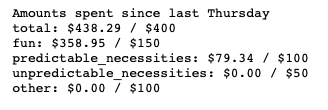

# Budget Tracker API

I want to track how much of my discretionary income I've spent since my last paycheck.

Additionally, I want to see how much of the money I've spent has gone towards certain categories I've defined:
- Fun (dining, entertainment, etc.)
- Predictable Necessities (groceries, gas, etc.)
- Unpredictable Necessities (car repairs/maintenance, medicine, etc.)
- Other

This project exposes a single endpoint that returns how much money I've spent in each of these categories in the current budgeting week, as well as the soft limits I've set for myself in each category. 

The production endpoint is [here](https://bbww2k2tyd.execute-api.us-west-2.amazonaws.com/Prod/hello/). 

Here's an example response (you can see that I was struggling to stay within my budget that week):

## Deployment Process
The following process is used to deploy code into production:
* Create a branch from main.
* Make your desired modifications to the branch.
* Raise a pull request into main.
* A status check named "build-deploy" will appear.
  * If the status check passes, then your PR will merge automatically. Your code is now deployed in production.
  * If the status check fails, then click "details" to see what the problem is. 
    * The job will re-run automatically if you add a new commit to the PR.
    * You may also re-run manually as needed.

## Continuous Deployment Pipeline

When a pull request is raised, the GitHub workflow called "prod-pipeline" is triggered. (This workflow is defined in .github/workflows/prod-pipeline.yml.)

* Dependencies are installed on the workflow server.
* Unit tests run (see tests/unit/unit_tests.py). 
* A Docker image is built and uploaded to Amazon ECR using an AWS SAM template (as defined in sam_template.yaml).
* The image is deployed to the QA environment, which is a Lambda function exposed by an API Gateway endpoint. 
* Acceptance tests run against the QA instance (see tests/acceptance/acceptance_tests.py)
* The image is deployed to the production environment, which is a Lambda function exposed by an API Gateway endpoint.

If any of the above steps fail, the remaining steps are not executed and a failing status check is reported to the pull request that the workflow is building from. If a step involving AWS SAM fails, any resources created during the step are automatically deleted. 

